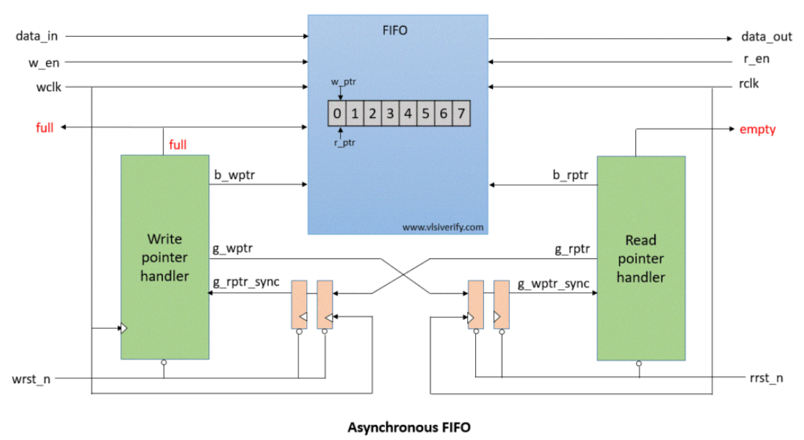
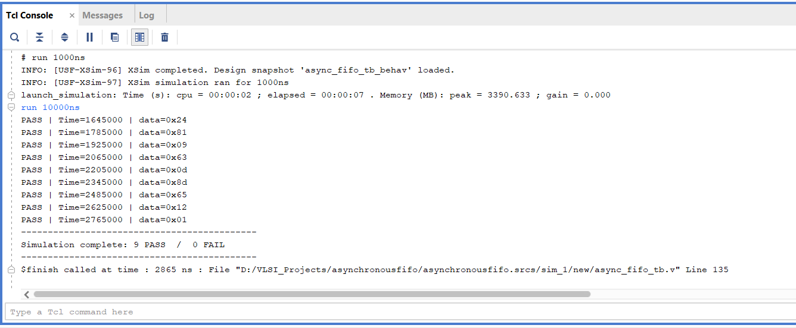
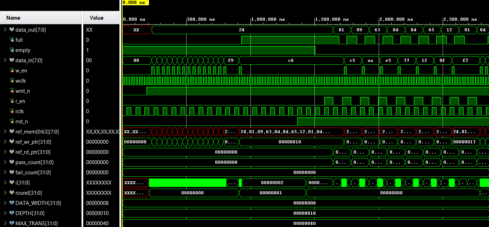

# Asynchronous-FIFO

A FIFO (First In First Out) is a buffer, data goes in one end and comes out the other in the same order, like a queue at a coffee shop.
An asynchronous FIFO takes this further. It lets two circuits running at different clock speeds share data safely. One side writes data fast, the other reads it slow (or vice versa), and the FIFO handles the mismatch without losing or corrupting anything.
Without it, directly connecting two circuits on different clocks causes metastability, a state where a signal gets stuck between 0 and 1, causing unpredictable behavior and system crashes.

# How it works:

1. Separate pointers for each side
The write side has its own pointer tracking where to write next. The read side has its own pointer tracking where to read next. They never interfere with each other.
2. Gray code for safe clock crossing
When a pointer needs to cross to the other clock domain (to check full/empty), it is converted to Gray code first. Gray code only changes 1 bit at a time, so even if the signal is sampled at the wrong moment, only 1 bit is ever uncertain — which is safe. A 2-flop synchronizer then resolves that uncertainty before the pointer is used.
   Full flag — generated on the write side when the write pointer has lapped the read pointer (FIFO has no more space)
   Empty flag — generated on the read side when the read pointer has caught up to the write pointer (nothing left to read)

# Parameters
Two values at the top of async_top.v control the entire design:
   parameter DEPTH      = 16   // how many words the FIFO holds
   parameter DATA_WIDTH = 8    // how wide each word is (bits)

# Applications
USB controllers — USB runs on its own clock; the rest of the chip runs on a different one. A FIFO bridges them.
UART / Serial communication — incoming serial data is clocked by the baud rate; the processor reads it on the system clock.
DDR memory controllers — memory and processor run at different frequencies; FIFOs buffer read/write requests.
Video processing — pixel data comes in from a sensor at one rate, gets processed at another.
FPGAs — almost any multi-clock FPGA design uses async FIFOs at the clock domain boundaries.

# How to Run in Vivado

1. Create a new RTL project in Vivado
2. Add these as Verilog design sources:
         synchronizer.v
         wptr_handler.v
         rptr_handler.v
         fifo_mem.v
         async_top.v
3. Add async_fifo_tb.v as a simulation source
4. Set async_fifo_tb as the simulation top module
5. Click Run Behavioral Simulation
6. In the Tcl Console, type: run 10000ns

